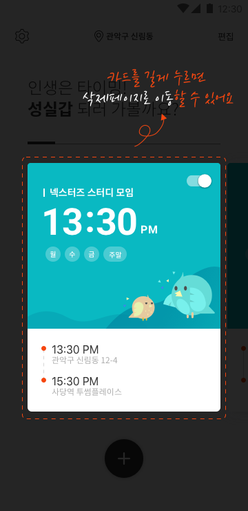
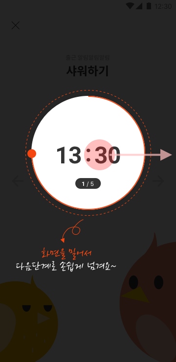
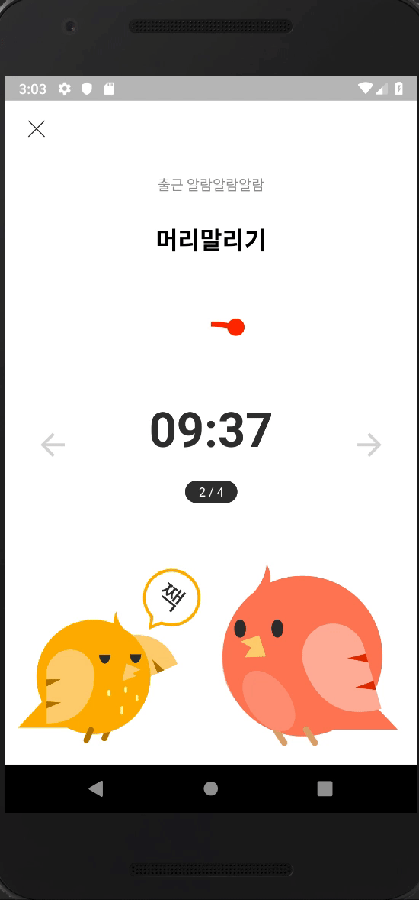

# 📃TickTock

### 지각방지용 타이머앱

 

 

## 주요 기능

### 1. 째깍째깍이 여러분의 준비패턴에 맞게 준비시작을 알려드립니다!
>작성할 때 마다 새로운 우표를 받을 수 있습니다.

### 2. 그냥 준비만하세요 
>지금 이시간에 무엇을 준비해야하는지 알려드릴께요.

### 3. 다음 지각자는 당신이 아닐꺼에요.

## 미리 보기

{width:20}

### 1. 알람 리스트를 카드 뷰 형식의 색다른 느낌으로 만나보세요.

### 2. 늦지도 않고 빠르지도 않은 적당한 시간에 맞춰 지각을 방지하세요.

### 3. '째깍째깍' 앱의 마스코트 짹이와 깍이가 여러분의 지각방지를 위해 도와줄거예요

## 사용 언어

* Kotlin
* Java

## 사용 라이브러리

* [RxAndroid](https://github.com/ReactiveX/RxAndroid) 
* [RxKotlin](https://github.com/ReactiveX/RxKotlin) 
* [Lottie](https://github.com/airbnb/lottie-android)
* [Odsay](https://lab.odsay.com/)
